<!DOCTYPE html>
<html lang="en">
<head>
    <meta charset="UTF-8">
    <meta name="viewport" content="width=device-width, initial-scale=1.0">
    <title>Image Gallery</title>
    <link href="https://cdnjs.cloudflare.com/ajax/libs/lightbox2/2.11.3/css/lightbox.min.css" rel="stylesheet">
    
</head>
<body>
    <main>
        <h1>Gilbertine Weekend Away - Hereford 2024</h1>
        
For the Gilbertine Lab, weekend away 2024, we headed to Hereford to sample the River Wye, through a day of canoeing.

        <section class="gallery">
            <figure class="gallery-item">
                <a href="images/IMG_5436.jpg" data-lightbox="gallery" data-title="The weekend Logo">
                    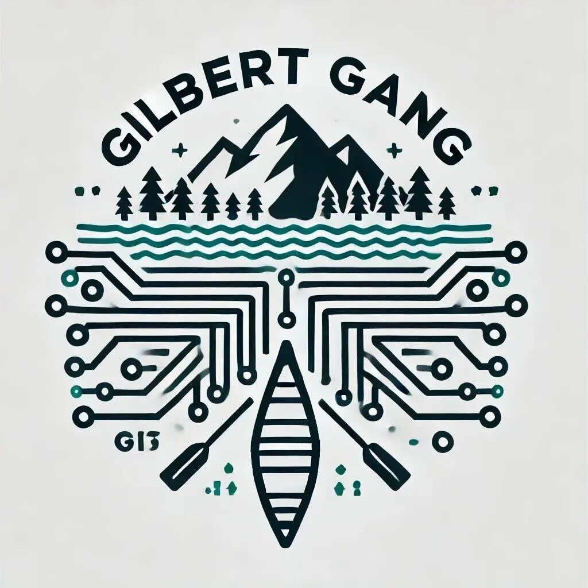
                </a>
                <figcaption class="caption">The weekend Logo</figcaption>
            </figure>
            <figure class="gallery-item">
                <a href="images/IMG-20240712-WA0003.jpg" data-lightbox="gallery" data-title="On top of the Malvern Hills">
                    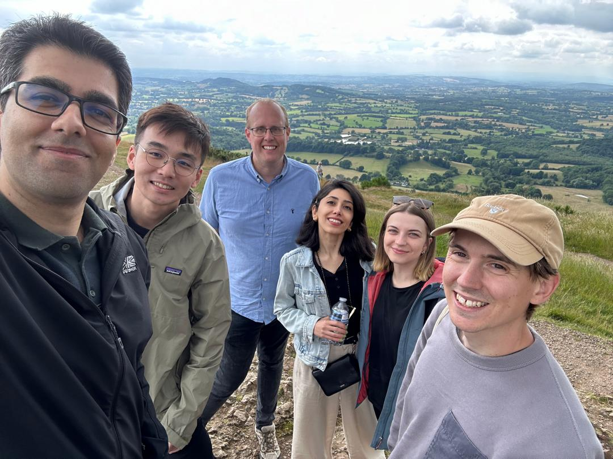
                </a>
                <figcaption class="caption">On top of the Malvern Hills</figcaption>
            </figure>
            <figure class="gallery-item">
                <a href="images/IMG-20240712-WA0007.jpg" data-lightbox="gallery" data-title="A cow">
                    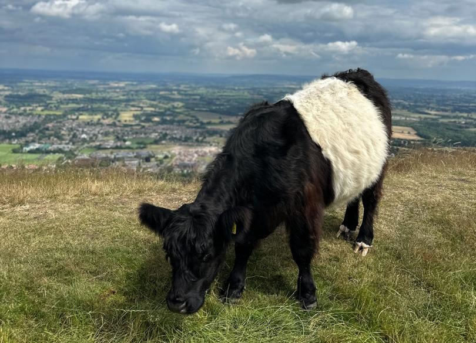
                </a>
                <figcaption class="caption">A cow</figcaption>
            </figure>
            <figure class="gallery-item">
                <a href="images/IMG-20240712-WA0013.jpg" data-lightbox="gallery" data-title="Pretty view of Malvern Hills">
                    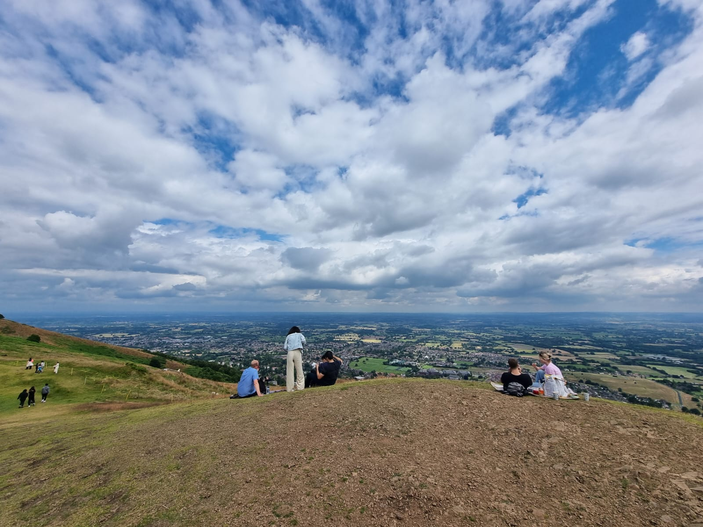
                </a>
                <figcaption class="caption">Pretty view of Malvern Hills</figcaption>
            </figure>
            <figure class="gallery-item">
                <a href="images/IMG-20240713-WA0001.jpg" data-lightbox="gallery" data-title="Canoeing on the River Wye">
                    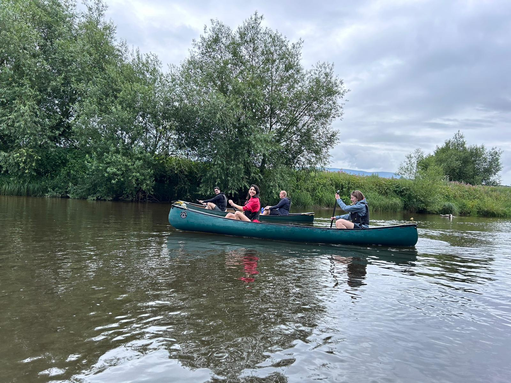
                </a>
                <figcaption class="caption">Canoeing on the River Wye</figcaption>
            </figure>
            <figure class="gallery-item">
                <a href="images/IMG-20240713-WA0003.jpg" data-lightbox="gallery" data-title="The Group, with Sadegh and I after just capsizing">
                    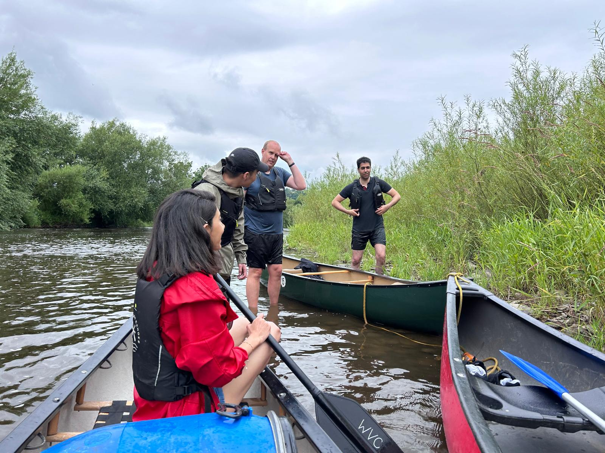
                </a>
                <figcaption class="caption">The Group, with Sadegh and I after just capsizing</figcaption>
            </figure>
            <figure class="gallery-item">
                <a href="images/IMG-20240713-WA0004.jpg" data-lightbox="gallery" data-title="Ed and Xu">
                    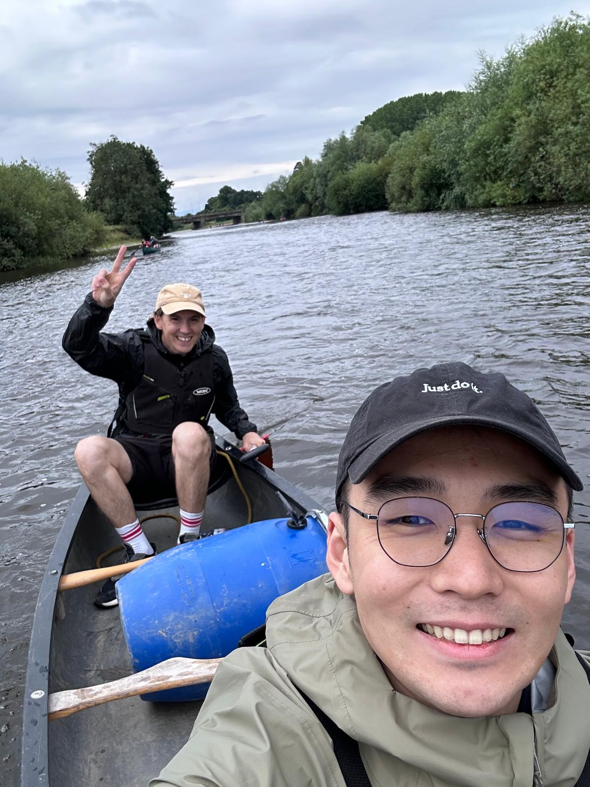
                </a>
                <figcaption class="caption">Ed and Xu</figcaption>
            </figure>
            <figure class="gallery-item">
                <a href="images/IMG-20240713-WA0007.jpg" data-lightbox="gallery" data-title="Adrienne and Mona">
                    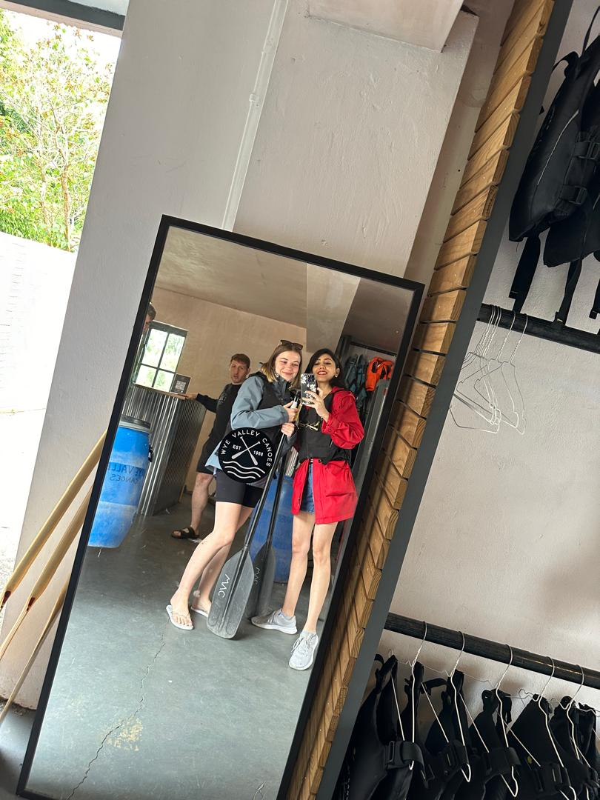
                </a>
                <figcaption class="caption">Adrienne and Mona</figcaption>
            </figure>
            <figure class="gallery-item">
                
                <figcaption class="caption">Moored up for lunch</figcaption>
            </figure>
            <figure class="gallery-item">
                <a href="images/IMG-20240713-WA0013.jpg" data-lightbox="gallery" data-title="We did it! 11 miles 4.5 hours">
                    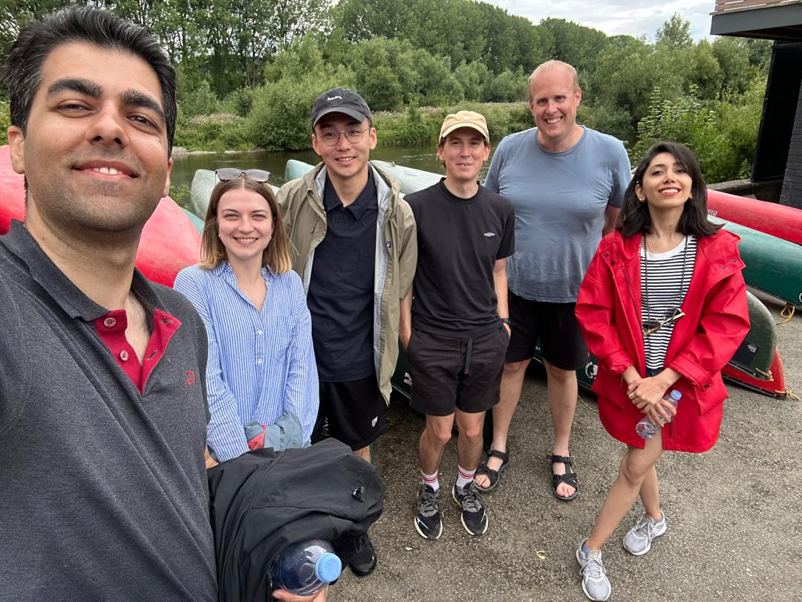
                </a>
                <figcaption class="caption">We did it! 11 miles 4.5 hours</figcaption>
            </figure>
            <figure class="gallery-item">
                
                <figcaption class="caption">Hay on Wye Castle for Lunch</figcaption>
            </figure>
            <figure class="gallery-item">
                <a href="images/PXL_20240713_195348632.MP.jpg" data-lightbox="gallery" data-title="Sadegh and Ed playing Pool">
                    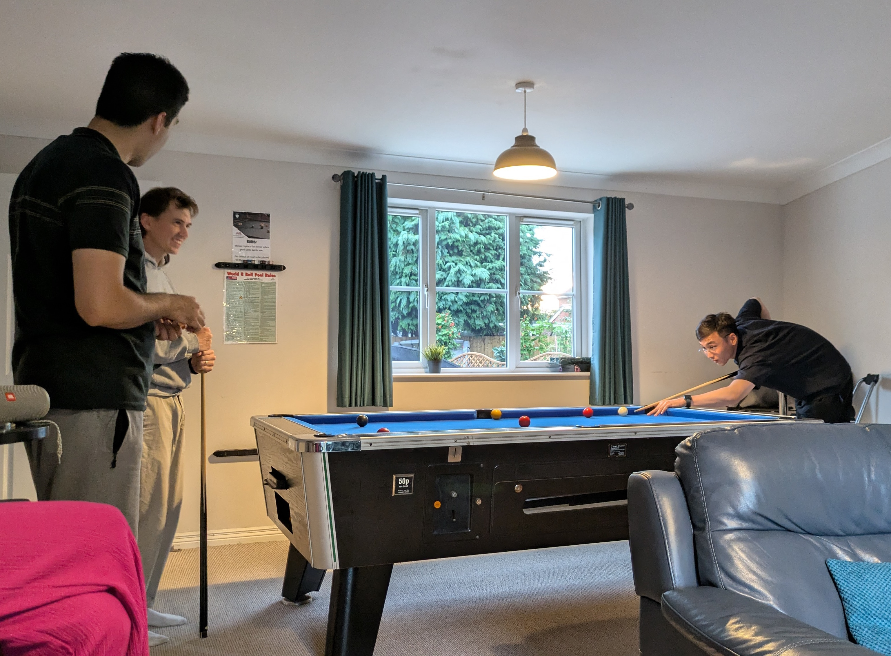
                </a>
                <figcaption class="caption">Sadegh and Ed playing Pool</figcaption>
            </figure>
            <figure class="gallery-item">
                <a href="images/PXL_20240713_091408242.jpg" data-lightbox="gallery" data-title="Paddling">
                    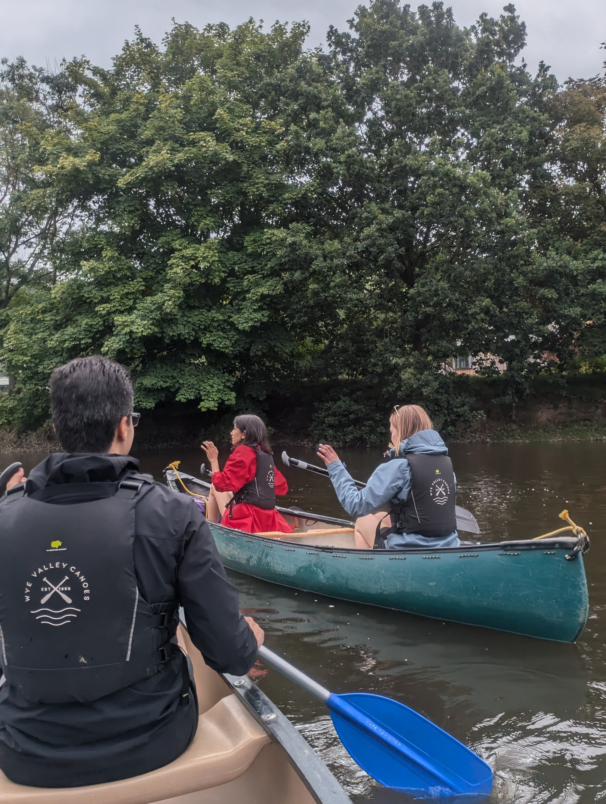
                </a>
                <figcaption class="caption">Paddling</figcaption>
            </figure>
            <figure class="gallery-item">
                <a href="images/IMG-20240713-WA0008.jpg" data-lightbox="gallery" data-title="Flowers">
                    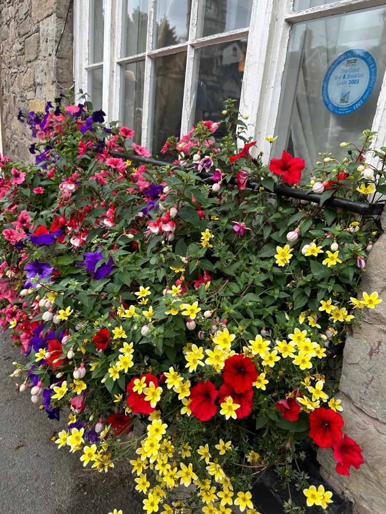
                </a>
                <figcaption class="caption">Flowers</figcaption>
            </figure>
            <figure class="gallery-item">
                <a href="images/IMG-20240712-WA0001.jpg" data-lightbox="gallery" data-title="Tesco">
                    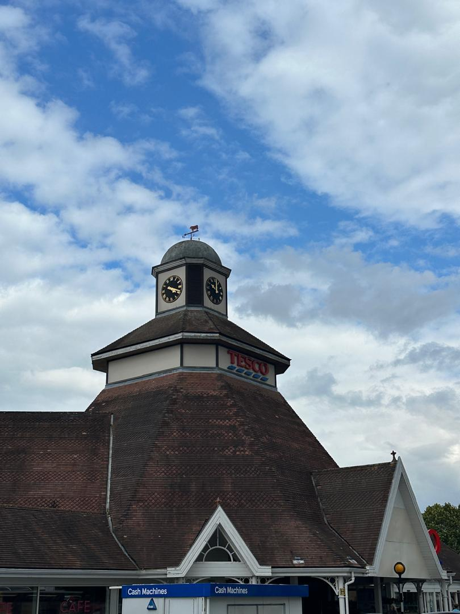
                </a>
                <figcaption class="caption">Tesco</figcaption>
            </figure>
            <figure class="gallery-item">
                <a href="images/IMG-20240714-WA0000.jpg" data-lightbox="gallery" data-title="Treasure Trail in Hereford">
                    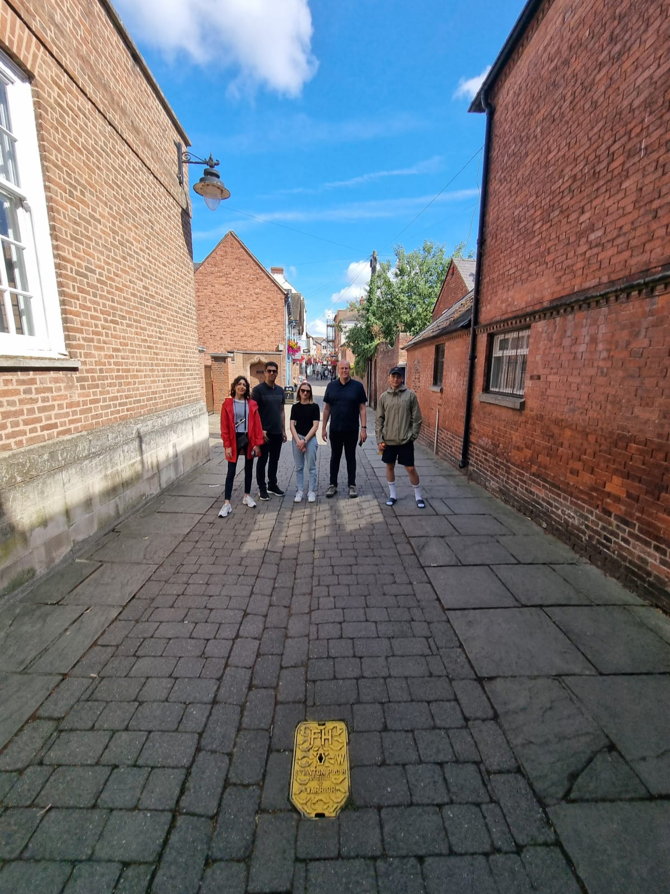
                </a>
                <figcaption class="caption">Treasure Trail in Hereford</figcaption>
            </figure>
            <figure class="gallery-item">
                <a href="images/IMG-20240714-WA0001.jpg" data-lightbox="gallery" data-title="Edgar and Xu">
                    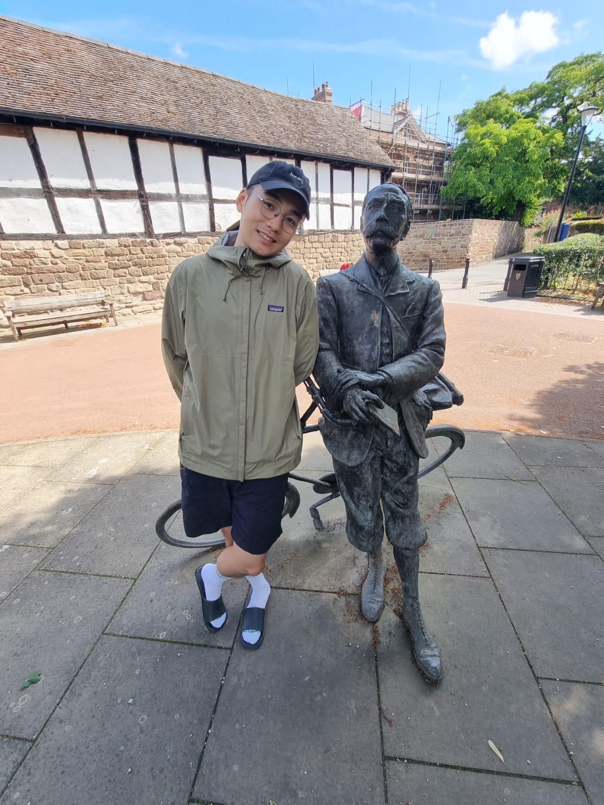
                </a>
                <figcaption class="caption">Edgar and Xu</figcaption>
            </figure>
            <figure class="gallery-item">
                <a href="images/IMG-20240714-WA0006.jpg" data-lightbox="gallery" data-title="The King Pigeon">
                    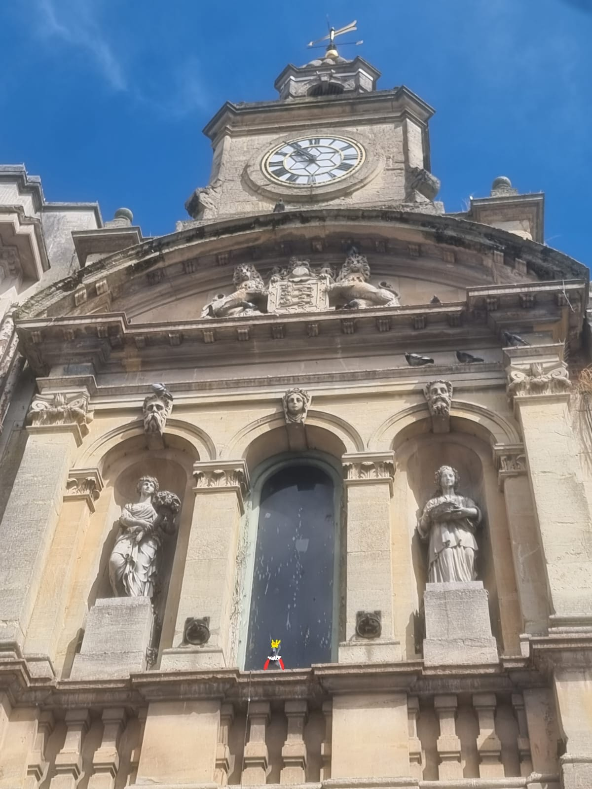
                </a>
                <figcaption class="caption">The King Pigeon</figcaption>
            </figure>                        
        </section>
        
Thank you for visiting the gallery!

    </main>
</body>
</html>